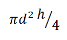
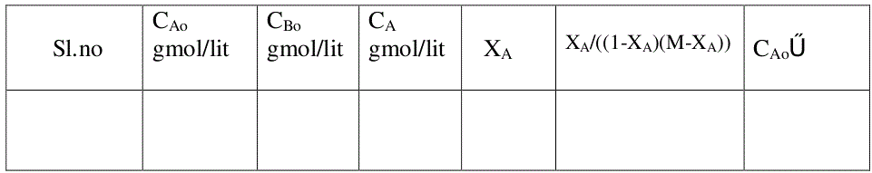
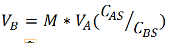
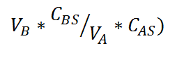
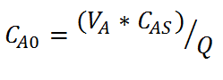
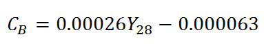
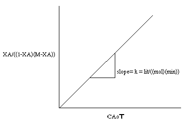
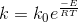

#### Apparatus required :

Conductivity meter.

#### Procedure :
<ol style="list-style-type: number; text-align: justify;">
<li>Standardise the NaOH stock solution and note down its concentration.</li>
<li>Calculate the concentration of ethyl acetate in stock solution</li>
<li>Fill the reservoirs with NaOH and ethyl acetate stock solutions</li>
<li>Measure the volume of the reactor.</li>
<li>Switch on the pump and allow ethyl acetate to flow into the reactor at certain
flowrate and measure the flowrate( VA ) using rotameter.</li>
<li> Set the required temperature to be maintained in the reactor. Switch on the
heater to heat the reactor contents to the required temperature .</li>
<li> Calculate the flowrate of NaOH( VB ) required to keep the desired value of M (M = CBO/CAO)
. M may be greater than or equal to one. Calculate the total
flowrate (Q).</li>
<li> Adjust the flowrate of NaOH to the calculated value, without changing the
EA flowrate.</li>
<li> Calculate the actual value of M obtained after adjusting the flowrates.</li>
<li> Calculate the space time using the total flow rate.</li>
<li> Start the stirrer in the reactor. Close the drain valve completely. Allow the
reaction to proceed till steady state is attained, as indicated by constant
reading in the conductivity meter.</li>
<li> Note down the conductivity (in mS/cm) of the reaction mixture in, after
steady state is attained. Note: Some conductivity meters may display
conductance (mS) not the conductivity(mS/cm) [Refer theory for more
information].</li>
<li> Determine the concentration of unreacted NaOH in the reaction mixture by
using the conductivity meter calibration equation.</li>
<li> Repeat steps (6) to (12) for different EA flowrates.</li>
<li> Conduct the experiment at different temperatures</li>
</ol>

#### Observations and calculations :
A = Ethyl acetate 
B = NaOH 
Strength of Ethyl acetate in stock = CAS = ------------------------ gmol/L  
Strength of NaOH in stock solution = CBS = ------------------------ gmol/L  
Diameter of the reaction vessel, d = -----------------------cm  
Height of the vessel upto reactor outlet, h = -----------------------cm  
V = volume of teh reactor==
= -----------------------cm3 
=     L 

  

##### Calculations :
Ethyl acetate flow rate = VA = ------------------------------LPH 
VB/VA = M(CAS/CBS)
Flow rate of NaOH required to keep the desired M , 
Flow rate of NaOH set, =
LPH
Total flow rate Q= VA+VB =
Space time , = V/Q =
min
Actual value of M(obtained in the experiment) =  
=
Initial concentartion of ethyl acetate in the feed mixture, 
  
CAo = --------------------gmol/L 
Concentartion of NaOH in the feed mixture, 
CBo = (VB*CBS)/Q
CBo = --------------------gmol/L 
As the conductivity meter calibration is available only at 28&deg;C, the conductivity
meter reading obtained at a given temperature of reaction is to be corrected for 28&deg;C. 
Temperature compensation for conductivity meter 

 

 
Where , 
YT =conductivity meter reading at any temperature T in mS/cm, 

 Y28 = conductivity meter reading at a temperature of 28&deg;C in mS/cm, 
Obtain
 Y28 corresponding to measured conductivity meter reading ( YT) using the
equation above. 
Conductivity meter is calibrated for concentrations of NaOH in the reaction mixture at a
temperature of 28&deg;C.
Obtain the Concentration of NaOH at 28&deg;C using the calibration equation given below 
Conductivity meter calibration equation for 28&deg;C. 

  

Where, 

 CB = Concentration of NaOH in the reaction mixture at steady state 
Y28 = Conductivity meter reading for solution, corrected for 28&deg;C 
Concentration of unreacted NaOH in the reaction mixture at steady state, 
CB=&nbsp;&nbsp;&nbsp;&nbsp;&nbsp;&nbsp;&nbsp;&nbsp;
gmol/L (obtained from the conductivity meter calibration
graph) 
Concentration of ethyl acetate in the reaction mixture at steady state,

 

 

 
  CA = --------------------gmol/L
 
Conversion of ethyl acetate,   

Performance equation for MFR with rate equation of the form   
can be written as
=
(
)
(B)
for MFR 
Plotting
(
)
vs
yields a straight line passing through origin. The
slope=k. The equation holds good for M=1 or greater than 1.
Plot a graph of   Vs &nbsp;CAoT
 

From the graph get,
k = -------------------------------litre/((gmol)(min))
Similarly the experiment may be performed with different temperatures and the
rate constants at these temperatures may be determined. Obtain the rate constant at three or more different temperatures.

##### From Arrhenius Equation,

 
 
Plot lnk vs 1/T 
Determine the activation energy (E) and the frequency factor (ko) from the slope and 
intercept of the above plot. 
Intercept= lnk0 
Slope=-E/R 
R is the gas constant 
Frequency factor , ko=min-1(litre / gmol) 
Activation energy= E=J/mol 

#### Results :

The rate constant for the saponification of Ethy acetate with NaOH at a temp of
ToC,
k = -------------------------------litre/((mol)(min))
Discuss and conclude on the temperature dependency of rate constant.
The activation energy (E) for the reaction=J/mol  
The frequency factor (ko)=min-1(litre / gmol)

