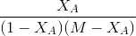

### Background and Theory

####	Flow Reactors :

 There are two types of flow reactors in common use in the
	chemical industry. They are the continuous stirred tank reactor (CSTR) and
	the tubular reactors. CSTR or Mixed flow reactor(MFR) is configured much
	like a batch reactor except reactants and products continuously flow in and
	out of the reactor. Steady state flow reactors are ideal for industrial
	purposes when large quantities of material are to be processed and when
	the rate of reaction is fairly high to extremely high. Flow reactors need more
	supporting equipment like pumps. But good product quality can be
	obtained.

#### Theory :

The continuous stirred-tank reactor (CSTR), also known as
back mix reactor, is a common ideal reactor type in chemical engineering.
Perfect mixing is assumed in case of Ideal CSTR .

	

In a perfectly mixed reactor, the output composition is identical to the
	composition of the material inside the reactor, which is a function of
	residence time and rate of reaction. The ideal CSTR model is often used to
	simplify engineering calculations and can be used to describe research
	reactors. In practice it can only be approached, in particular in industrial
	size reactors.
	Space time () is the time required to process one reactor volume of feed at
	specified condition.
	 =V/volumetric flow rate of feed

##### Mass Balance Equation :

rate of input - rate of output- rate of disappearance = rate of accumulation
	

There are some basic assumptions made in analysing CSTR reactors.
These are

<ul style="text-align: justify;">
<li>The reactor runs at steady state i.e. all of the time derivatives go to zero.</li>
<li>None of the variables (temperature, concentration, reaction rate, etc) are
functions of position, i.e. all of the spatial derivatives go to zero.</li>
<li>The conditions that exist at the exit are the same as those everywhere in
the reactor.</li>
</ul>

Since steady state is assumed, the dNj/dt term is equal to zero. Setting the rate term equal to a -rj, the equation can now be solved for the volume to
yield

Fj0 = molar flowrate of reactant j 
Fj = output molar flowrate of reactant j 
rj = rate of reaction of reactant molecule j 
V = volume of the reactor 
Nj = number 
Fi0
of moles of component j = the molar flow rate can be expressed as the product of the
concentration of the species and the volumetric flow rate (V0). 
Fj0 = Cj0*v0 
The design equation for CSTR is given by  

------(A)

Volume of a CSTR with given influent flow rate and feed composition
to achieve a required conversion may be obtained from the above
equation, if the rate equation is known. -rA in the above equation
correspond to the exit conversion or concentration.
Rate equation for a given reaction can be obtained using a CSTR.
For a single reaction say, A+B-->C+D 
Assume the rate equation to be  and a constant density system
Experiments to be performed with different space times in the reactor with
the known ratio of reactant B to A(M) in the inlet. Steady state
concentration of A may be analysed for each run.  
Now equation A can be written as  

------(B)

for MFR    
 Plotting
vs  yields a straight line passing through origin if
the assumed equation is correct. The slope=k. The equation holds good for
M=1 or greater than 1. 

If the data do not fit by a straight line assume different equation and
proceed as above.

